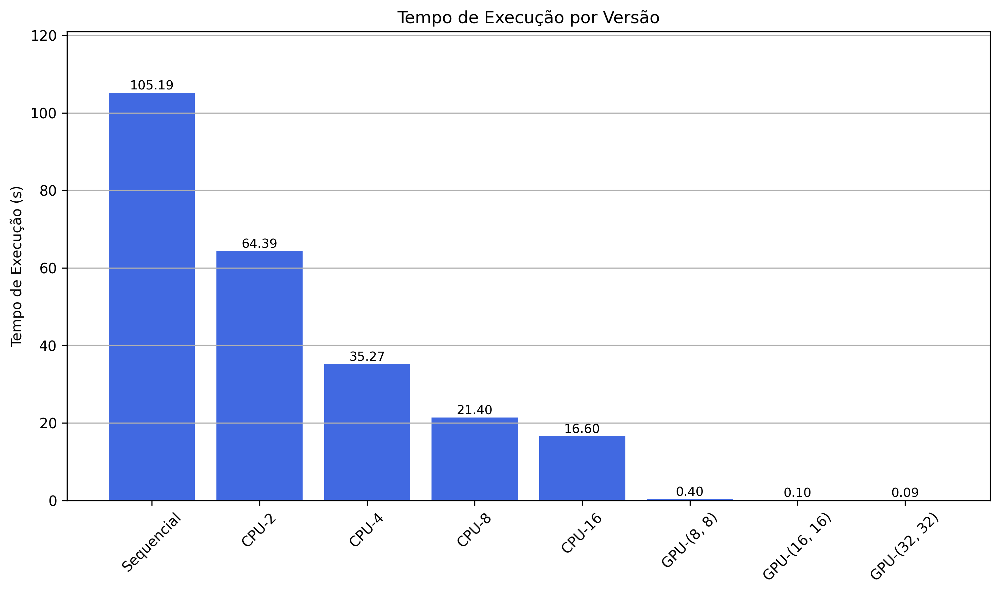
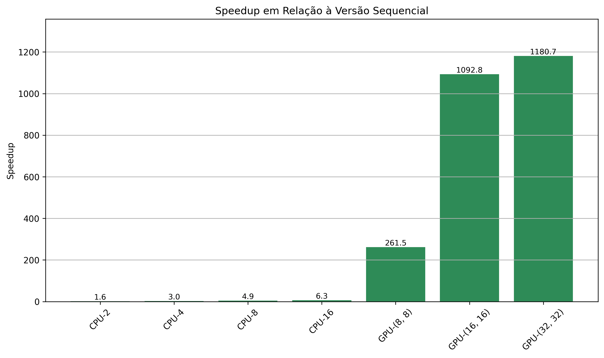
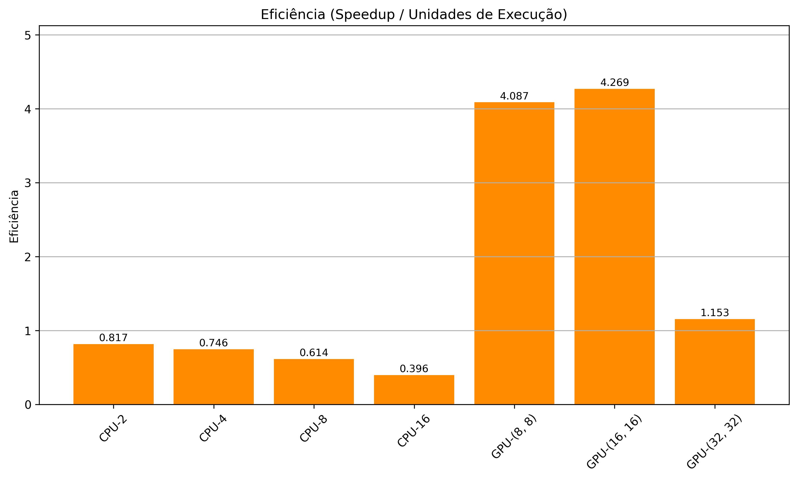
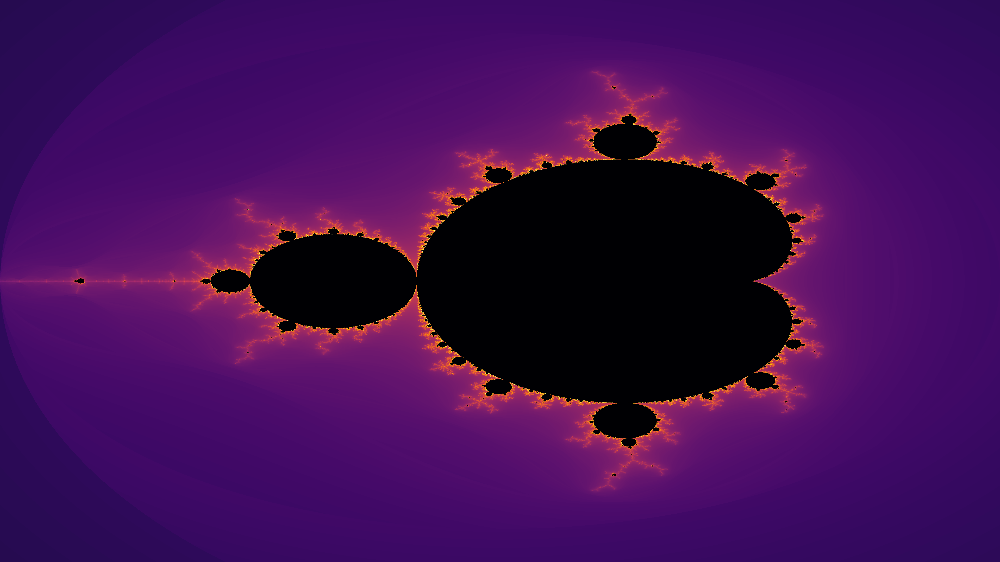

# Mandelbrot Fractal - Computação Paralela com CPU e GPU

Este projeto tem como objetivo gerar imagens do conjunto de Mandelbrot utilizando diferentes técnicas de programação paralela e comparar seu desempenho com uma versão sequencial. A aplicação utiliza Python e explora processamento paralelo com `joblib` (CPU) e `CUDA` via `numba` (GPU).

---

## 🧠 Conceito

O conjunto de Mandelbrot é um fractal famoso definido a partir de números complexos. Para cada ponto do plano complexo, é calculado quantas iterações são necessárias para determinar se ele "escapa" ou não de uma certa condição. A computação desse conjunto é intensiva e ideal para aplicações paralelas.

---

## 🚀 Tecnologias Utilizadas

- Python 3.10+
- Numba (CUDA)
- Joblib
- Matplotlib
- NumPy
- Jupyter Notebook
- CUDA Toolkit (NVIDIA)

---

## 🧩 Implementações

### ✅ Versão Sequencial
Implementada com `for` loops clássicos. Serve como base de comparação de desempenho.

### ✅ Versão Paralela com CPU
Utiliza `joblib.Parallel` para distribuir o cálculo de linhas entre múltiplas threads/processos.

### ✅ Versão com GPU (CUDA)
Implementada com `numba.cuda.jit`, executando o kernel direto na GPU para ganho máximo de desempenho.

---

## 🧪 Benchmark

Durante os testes, foram medidos:

- Tempo de execução (s)
- Speedup em relação à versão sequencial
- Eficiência (speedup / número de unidades de execução)

### Exemplo de Resultados:

| Versão         | Tempo (s) | Speedup | Eficiência |
|----------------|-----------|---------|------------|
| Sequencial     | 105.32    | 1.00    | 1.00       |
| CPU-4 threads  | 31.51     | 3.3     | 0.83       |
| CPU-8 threads  | 8.19      | 5.4     | 0.67       |
| GPU-(16x16)    | 0.20      | 1322.7  | 5.15       |

> O speedup real pode variar conforme o hardware.

---

## 📈 Gráficos Gerados

- Tempo de execução por versão
- Speedup em relação à versão sequencial
- Eficiência relativa (speedup/unidades de execução)

### Visualizações:





---

## 📸 Exemplos de Saída



Imagem do conjunto de Mandelbrot gerado com smooth coloring utilizando GPU.

---

## 🛠️ Como Executar

1. Clone o repositório:
   ```bash
   git clone https://github.com/pedropps1/mandelbrot-paralelo.git
   cd nome-repositorio
